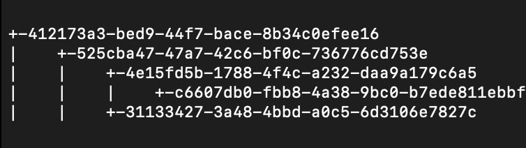

# PixV (Image Version Control System)

PixV pypi package -> (https://pypi.org/project/pixv/).
Current stable release is pixv==0.1.2

## Description 

PixV is an image version control system designed to efficiently manage image changes, minimizing storage usage. Accessible as a Python package via pip install pixv, PixV utilizes a graph data structure, where each node represents a version. The project boasts numerous features for accessing different versions and offers versatile functionalities.


## Table  of Contents
- Installation
- Features
- Optimizations
- Dependencies
- Future Development Goals
- Authors
- License

## Installation
Any of the below methods can be used to access PixV.

- Install PixV with pip

  ```bash
    pip install pixv
  ```

-  Clone the repository and use feature.py in src directory to access all commands

  ```bash
    git clone https://github.com/ReallyJaegar/PixV.git
    pip install -r requirements.txt
  ``` 
  ```
    pthon3 feature.py [COMMAND] [OPTIONS]
  ```

## Features
- ## Add New Image in PixV

To intialise the tree of version control system.
Further versions can only be created once the root node is created.

It creates a root node (nodes.rootNode).

-
  ```bash
  pixv add [path/to/image.png] --author [NAME]
  ```
  or
-
  ```bash
  python3 feature.py add [path/to/image.png] --author [NAME]"
  ```  
- ## Commit Changes
To add versions to the image once the root node (nodes.rootNode) has been initialised.

Wont work if the nodes.rootNode has not been initialised.

-
  ```bash
  pixv commit [path/to/image.png] --message [COMMIT MESSAGE] --author [NAME]
  ```

    or

-
  ```bash
  python3 feature.py commit path/to/image.png --message "commit_message" --author "Name of author"
  ```


- ## Logs : 
#####  Displays all the versions of the image availiable in the project along with their uuid ,author ,time, commit_message.

To use the function run the following command in your terminal :

-
  ```bash
  pixv logs [path/to/image.png]
  ```
  or

-
  ```bash
  python3 feature.py logs path/to/image.png 
  ```

####
- ## Push and Pull 
##### Push : It uploads local repository content to a remote repository.
##### Pull :  It fetches changes from a remote repository
####
Commands :

-
  -
    Push: ```python3 feature.py push path/to/image.png```
  -
    Pull: ```python3 feature.py push path/to/image.png```

  or
-
  -
    Push: ```pixv push [path/to/image.png]```
  -
    Pull: ```pixv push [path/to/image.png]```


####
- ## Forward & Revert
##### Forward : Feature to move to Next availiable Version 
##### Revert : Feature to move back to the previous Version
####
Commands:
####
Forward : ```python3 feature.py forward path/to/image.png```
####
Revert : ```python3 feature.py revert path/to/image.png```
#### or
####
Forward : ```pixv forward [path/to/image.png]```
####
Revert : ```pixv feature.py revert [path/to/image.png]```

####
- ## Shift
##### Can Shift to any version of the image using only this following command:
-
  ```python3 feature.py shift path/to/image.png --id [unique id of the version]```
#### or

- 
  ```pixv shift [path/to/image.png] --id [unique id of the version]```
####
#### Note : unique id can be seen using Logs command
####
- ## Hist
Using this function the user will be able to visualize the complete graph structure in the terminal.
####
-
  ```python3 feature.py hist [image.png]```
  or
-
  ```pixv hist [image.png]```

The graph structure will look like this:



####
- ## Locate 
####
Using this function user can locate where head is pointing.
####
-
  ```python3 feature.py locate path/to/image.png```
  or

-
  ```pixv locate [path/to/image.png]```


#####
- ## Original
#####
Brings back the original version of the image
###
-
  ```python3 feature.py original path/to/image.png```
  or
-
  ```pixv original [path/to/image.png]```

####
- ## Show 
#####
##### Using the following command user can load the image on the current HEAD location in the imageGraph :
-
  ```
  python3 feature.py show [name of image]
  ``````

or

-
  ```pixv show [nameofimage]```


## Optimizations

We've enhanced the version control system to minimize storage usage by storing only the changes between consecutive versions.


## Dependencies
- #### Pillow==10.0.1
- #### numpy==1.26.1
- #### requests==2.31.0
- #### matplotlib==3.8.2
- #### click==8.1.7
###

If you want to create your own server for file sharing :

- Use the file_server.py 


## Future Development Goals

- ### Adding Merge Operation
####
- ### GUI for the Version Control System
####
- ### Can be operated for any type of image format
####

## Authors

- [@Som Shekhar Sharma](https://github.com/ReallyJaegar)
- [@Dhruv Sagar](https://github.com/dhruvsagar24)


## License

[MIT](https://choosealicense.com/licenses/mit/)